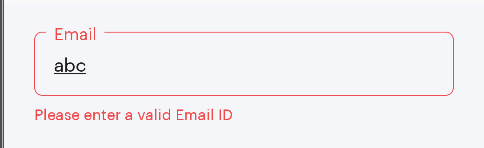

# README #

# CustomEdittecxtOutlineBorder

[](https://kotlinlang.org)
[](https://android-arsenal.com/api?level=21)

Getting Started
------------------------
CustomEdittextOulinedBorder is a small kotlin library. It's same as Material Design Outlined Box but here I gave some dynamic feature for error display, different stroke color.

### Gradle Dependency
* Add the JitPack repository to your project's build.gradle file

```
allprojects {
    repositories {
        ...
        maven { url 'https://jitpack.io' }
    }
}
```

* Add the dependency in your app's build.gradle file

```
dependencies {
	        implementation 'com.github.ShwetaChauhan18:CustomEditTextOutLineBorder:1.0.0'
}
```



       
