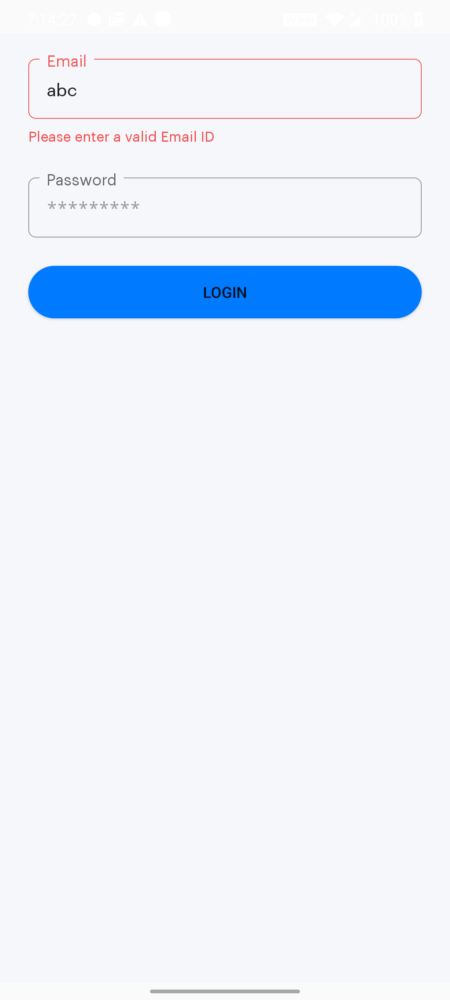

# README #

# CustomEdittecxtOutlineBorder

[](https://kotlinlang.org)
[](https://android-arsenal.com/api?level=21)

Getting Started
------------------------
CustomEdittextOulinedBorder is a small kotlin library. It's same as Material Design Outlined Box but it's with some dynamic feature for error display, different stroke color, with hint and lable.

### Gradle Dependency
* Add the JitPack repository to your project's build.gradle file

```
allprojects {
    repositories {
        ...
        maven { url 'https://jitpack.io' }
    }
}
```

* Add the dependency in your app's build.gradle file

```
dependencies {
	implementation 'com.github.simformsolutions:CustomEditTextOutLineBorder:1.0.0'
}
```

##### All Attributes

| Attribute | Description | Default |
| --- | --- | --- |
| `app:isErrorEnable` | Whether the EditText error is enabled | `False` |
| `app:custom_component_title` | Set Outlined border title text | `R.string.app_name` |
| `app:custom_component_editText_hint` | Set EditText hint | `R.string.app_name` |
| `app:custom_component_maxline` | Set maximum height of the EditText | `1` |
| `app:custom_component_minline` | Set minimum height of the EditText | `1` |
| `app:custom_component_title_bg_color` | Set Outlined border title background color | `R.color.colorPrimary` |
| `app:custom_component_editText_bg_color` | Set EditText background color | `R.color.colorPrimary` |
| `app:custom_component_maxLength` | Set EditText maxLength | `99` |
| `android:inputType` | Set EditText inputType | `EditorInfo.TYPE_TEXT_VARIATION_NORMAL` |

* Example
```
<shweta.com.customedittextoutlinedborder.CustomComponent
            android:id="@+id/edtPassword"
            android:layout_width="0dp"
            android:layout_height="wrap_content"
            android:layout_marginTop="@dimen/_10sdp"
            android:inputType="textPassword"
            app:custom_component_editText_hint="@string/edt_hint_password"
            app:custom_component_maxLength="15"
            app:custom_component_title="@string/edt_title_password"
            app:errorTextValue="@{formMessage.password}"
            app:isErrorEnable="@{formMessage.isPasswordError}"
            app:layout_constraintEnd_toEndOf="@+id/edtEmail"
            app:layout_constraintStart_toStartOf="@+id/edtEmail"
            app:layout_constraintTop_toBottomOf="@+id/edtEmail"
            app:textValue="@={viewModel.password}" />
```

